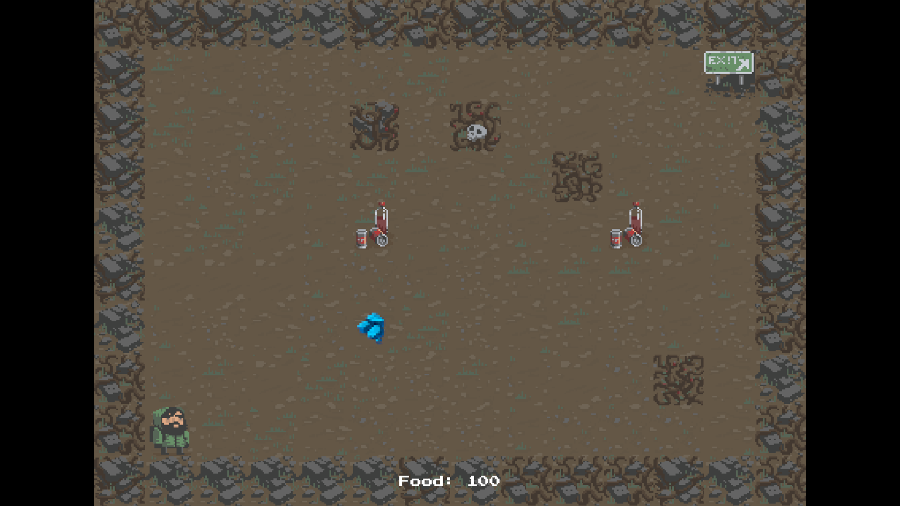
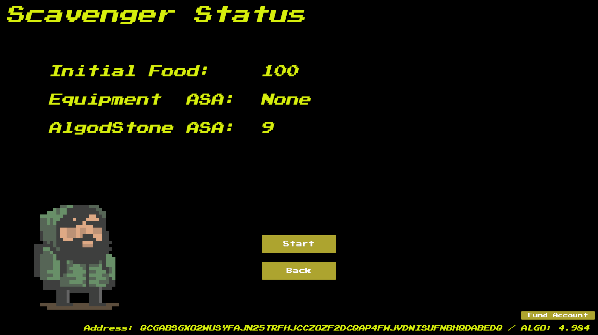

# AlgodScavenger

A 2D rogue like game on Algorand.

## Story

Welcome to AlgodScavenger!

In this adventure, you dive into the world of Algorand blockchain, searching for the elusive Algod Stone hidden in the mined blocks.

These stones are not just valuable - they're powerful Algorand ASAs, tradable within the blockchain world.

## Integration with Algorand

- When user start new game, new Algorand account is created, and player must fund the account to initiate the game start transaction
- When player send the game start transaction, the transaction hash is stored and used as seed to stage generation
- When player found the AlgodStone, the ASA is transfered to the user account

## Reference

### Algoland Unity SDK

Most of the Algorand integration is kept here.

https://github.com/taijusanagi/AlgodScavenger/blob/main/Assets/Scripts/AlgodManager.cs

### Asset from Unity Asset Store

For this hackathon, we focused on integrating Algorand blockchain into game, so game part is almost from this tutorial.

https://learn.unity.com/project/2d-roguelike-tutorial

Based on the tutorial, we added the followings

- Original story for Algod Stone and Scavenger
- Create Algorand local wallet
- Send Algorand tx for game start
- Transfer Algorand ASA for Algod Stone picking
- Required UI for the Algorand integration
