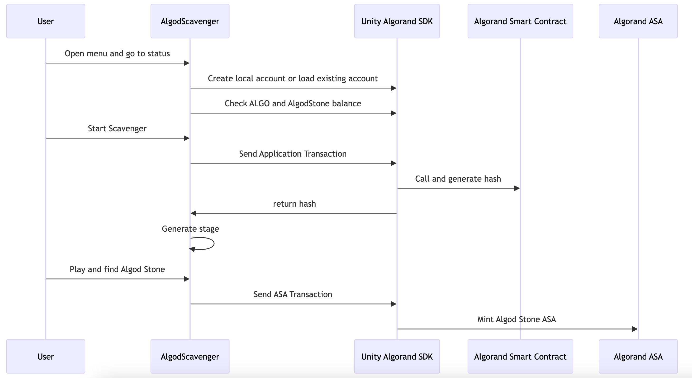

# AlgodScavenger

A 2D rogue like game on Algorand.

## Submission

### Live App

https://play.unity.com/mg/other/webgl-builds-378799

### Demo Video

https://youtu.be/QYshdCvxCTI

### Pitch Deck

https://docs.google.com/presentation/d/1iGdikHHLUFM1lfuydqwcBBWoTp32Iwx81aLOcgApmtE/edit?usp=sharing

## Story

Welcome to AlgodScavenger!

In this adventure, you dive into the world of Algorand blockchain, searching for the elusive Algod Stone hidden in the mined blocks.

These stones are not just valuable - they're powerful Algorand ASAs, tradable within the blockchain world.

## Game Design

- Random stage is generate every time you start the game based on the Algorand Tx hash
- Player consumes food when move, and it can be restored by picking fruit or soda
- Enemy may attack player and huge amount of food is lost when attacked
- Sometimes, there is AlgoStone can be picked, when it is picked, the ASA is sent to user
- So, user is to pick food, avoid enemy, then pick more Algod Stone!

## Integration with Algorand

- When user start new game, new Algorand account is created, and player must fund the account to initiate the game start transaction
- When player send the game start transaction, the transaction hash is stored and used as seed to stage generation
- When player found the AlgodStone, the ASA is transfered to the user account

## Benefit

- **Innovative Gameplay Integration:** AlgodScavenger leverages the Unity Algorand SDK and ASA for creating a unique gaming experience. It features random map generation tied to Algorand transaction hashes and incorporates a fungible token system, offering a distinct and engaging gameplay mechanic.

- **Future Expansion Potential:** The game plans to introduce Non-Fungible ASAs, such as in-game equipment, enhancing the utility and diversity within the Algorand Ecosystem. This expansion not only enriches the gaming experience but also opens new avenues for user engagement and asset collection.

- **Blockchain-Enabled Features:** AlgodScavenger integrates blockchain technology at its core. The game utilizes smart contracts to record all adventure activities, supporting a native ranking and trophy system on the blockchain. This feature not only adds an element of competitiveness but also ensures transparency and fairness in player achievements. Additionally, its innovative approach can serve as an SDK, attracting more developers to the Algorand platform.

## Reference

### Algoland Unity SDK

Most of the Algorand integration is kept here.

https://github.com/taijusanagi/AlgodScavenger/blob/main/Assets/Scripts/AlgodManager.cs

### Asset from Unity Asset Store

For this hackathon, we focused on integrating Algorand blockchain into game, so game part is almost from this tutorial.

https://learn.unity.com/project/2d-roguelike-tutorial

Based on the tutorial, we added the followings

- Original story for Algod Stone and Scavenger
- Create Algorand local wallet
- Send Algorand tx for game start
- Transfer Algorand ASA for Algod Stone picking
- Required UI for the Algorand integration
